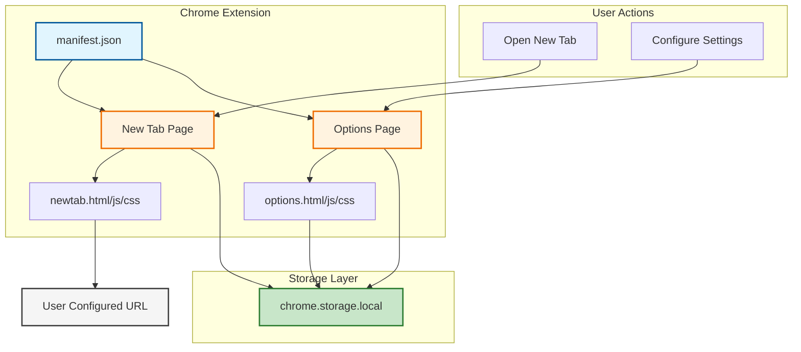
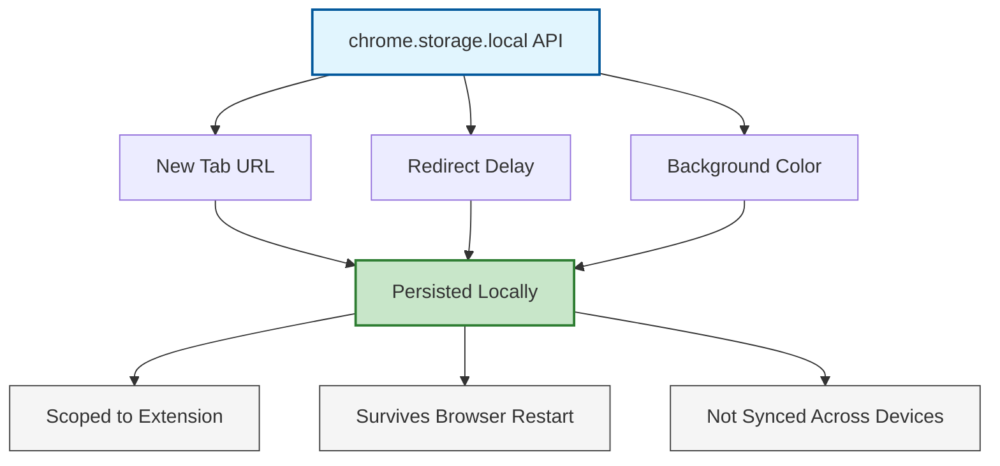
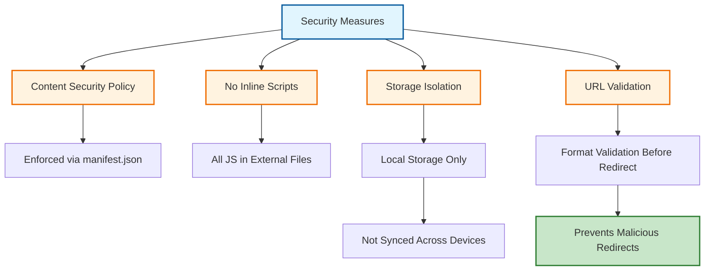
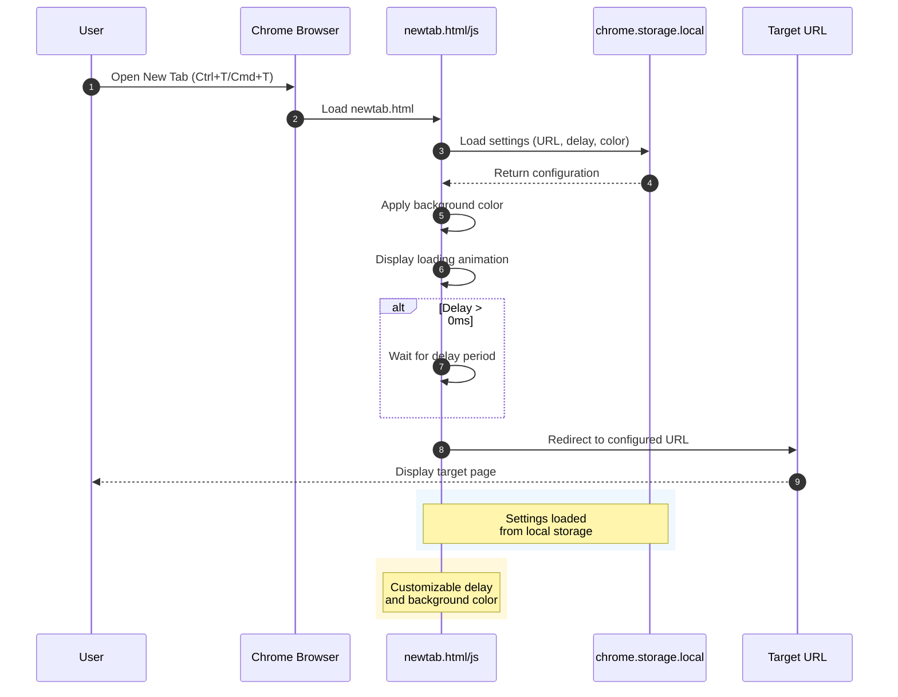
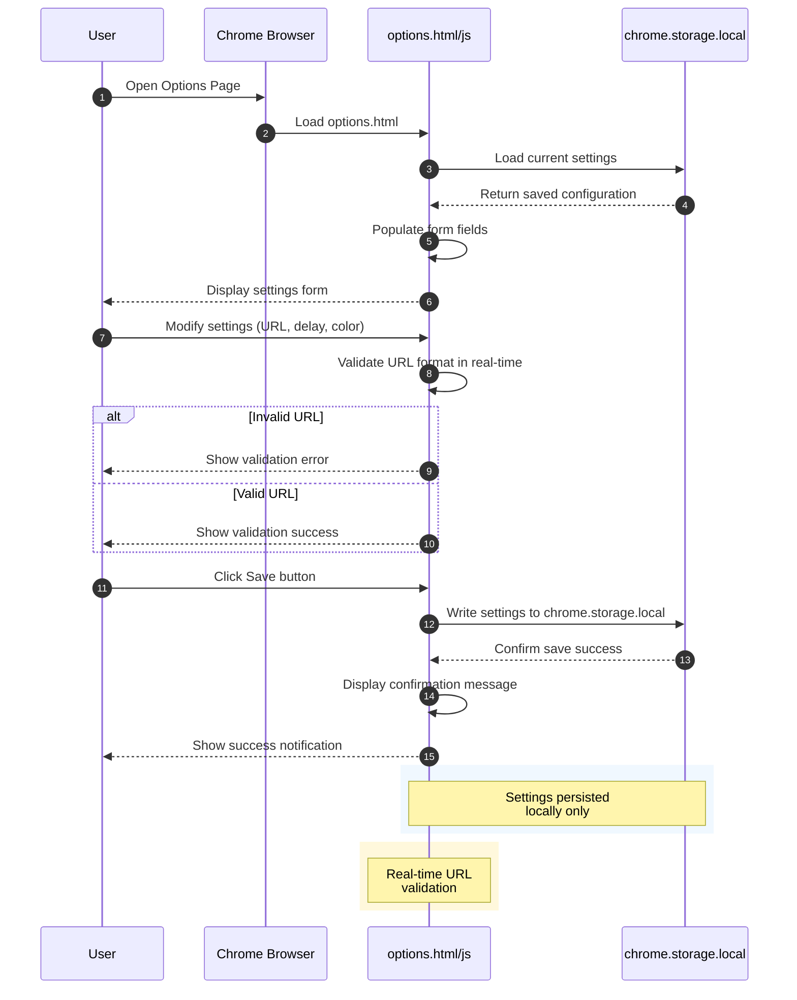
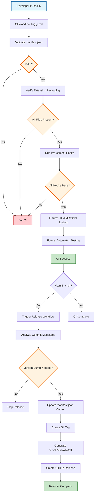
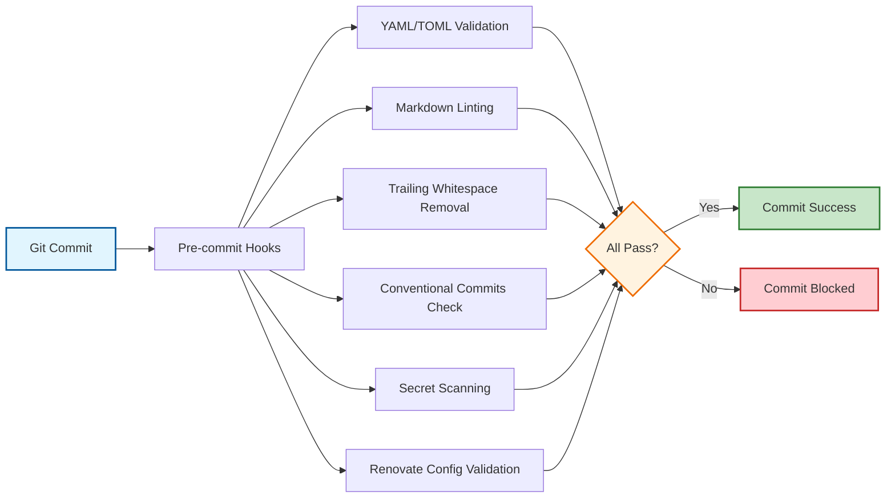

# System Architecture

This document describes the architecture of the Dark New Tab Homepage Chrome extension.

## Overview

Dark New Tab Homepage is a Chrome extension that replaces the default new tab page with a customizable dark-themed homepage that redirects to a user-configured URL.

## Architecture Components

### Extension Files

#### manifest.json

The extension manifest file (Manifest V3) that defines:

- Extension metadata (name, version, description)
- Permissions (storage API)
- New tab override configuration
- Options page configuration
- Content Security Policy

#### New Tab Page (newtab.html, newtab.js, newtab.css)

The new tab page component that:

- Displays a dark-themed loading screen
- Shows a loading animation during redirect delay
- Redirects to the configured URL after delay
- Applies custom background color
- Handles URL configuration and redirect logic

#### Options Page (options.html, options.js, options.css)

The options/settings page that:

- Provides UI for configuring new tab URL
- Allows setting redirect delay (0-60000ms)
- Provides color picker for background customization
- Shows preset color options
- Validates URL format and domain resolution
- Saves settings to Chrome storage
- Displays extension version and git commit hash

### Storage

Uses `chrome.storage.local` API to persist:

- New tab URL
- Redirect delay
- Background color preference

Settings persist across browser sessions and are scoped to the extension.

### Security

Security features:

- **Content Security Policy**: Enforced via manifest.json
- **No Inline Scripts**: All JavaScript in external files
- **Storage Isolation**: Settings stored locally, not synced
- **URL Validation**: Domain format validation before redirect

## Data Flow

### New Tab Flow

The new tab flow process:

1. User opens new tab (`Ctrl+T` / `Cmd+T`)
2. Chrome loads `newtab.html`
3. `newtab.js` loads settings from `chrome.storage.local`
4. Page displays with configured background color
5. Loading animation shows (if delay > 0)
6. After delay, redirects to configured URL

### Options Page Flow

The options page flow process:

1. User opens options page (right-click extension → Options)
2. `options.js` loads current settings from storage
3. User modifies settings (URL, delay, color)
4. URL validation runs in real-time
5. User clicks "Save"
6. Settings written to `chrome.storage.local`
7. Confirmation message displayed

## DevOps Infrastructure

### CI/CD Pipeline

**CI Workflow** (`.github/workflows/ci.yml`):

- Validates manifest.json syntax and structure
- Verifies Chrome extension packaging (all required files present)
- Runs pre-commit hooks for code quality
- Placeholder steps for future HTML/CSS/JS linting
- Placeholder steps for future automated testing

**Release Workflow** (`.github/workflows/release.yml`):

- Triggers after successful CI completion
- Analyzes commit messages for version bumps
- Updates `manifest.json` version automatically
- Creates git tags in format `v{version}`
- Generates `CHANGELOG.md` from commits
- Creates GitHub releases

### Code Quality

**Pre-commit Hooks** (`.pre-commit-config.yaml`):

- YAML/TOML validation
- Markdown linting
- Trailing whitespace removal
- Conventional Commits enforcement
- Secret scanning (Gitleaks)
- Renovate config validation

## Technology Stack

- **Runtime**: Chrome Extension APIs (Manifest V3)
- **Storage**: chrome.storage.local API
- **Styling**: CSS3 with dark theme
- **Testing**: Playwright with TypeScript and Page Object Model
- **Version Management**: python-semantic-release
- **CI/CD**: GitHub Actions
- **Code Quality**: pre-commit hooks, markdownlint, commitlint

## Future Enhancements

### Planned Features

- HTML/CSS/JS linting tools
- Chrome Web Store publishing automation
- Additional customization options
- Expanded test coverage for edge cases

### Testing

The project uses Playwright for automated end-to-end testing. See [testing.md](testing.md) for comprehensive documentation on:

- Test suite architecture and fixtures
- Page Object Model implementation
- Writing and running tests
- CI/CD integration

### Architecture Considerations

- Extension is lightweight with no external dependencies
- All code runs in extension context (no external servers)
- Settings stored locally for privacy
- Designed for easy customization and extension

## Security Considerations

- No external API calls (except user-configured redirect)
- Settings stored locally (not synced across devices)
- Content Security Policy prevents inline scripts
- URL validation prevents malicious redirects
- Secret scanning prevents credential leaks

## Performance

- Minimal resource usage
- Fast page load (no external resources)
- Efficient storage API usage
- Smooth animations and transitions

## Maintenance

- Version managed automatically via semantic-release
- Code quality enforced via pre-commit hooks
- CI/CD validates changes before merge
- Documentation maintained alongside code
